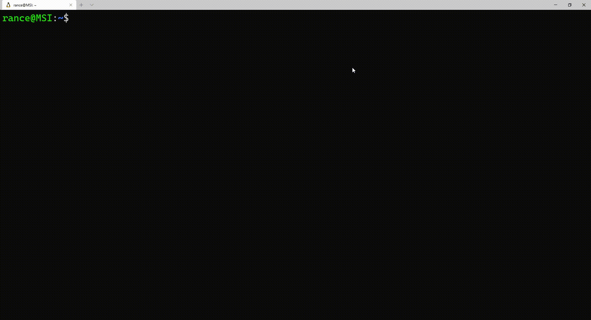

# Stonks CLI

## Description

With all the recent buzz on the stock market, I was getting tired of constantly checking specific stocks online. This inspired me to create this little commandline tool to get stock quotes instantly. All you need is an API key to the [Finnhub](https://finnhub.io/) financial API and you are on your way! I set the executable in the `PATH` environment variable so that wherever I am I can type `stonks <ticker>` and get a real time quote for where the price is at. This has only been tested on Linux, but should work on Mac. Feel free to take this and make it your own!

## Installation

- Clone repo

- Navigate to base directory

- Run `make`

- Set `FINNHUB_API_KEY` environment variable to your Finnhub API key

- Run `stonks <ticker>` where the ticker is any valid stock ticker symbol

## Dependancies

- CURL C library
- C compiler (set in *Makefile*)
- [Finnhub](https://finnhub.io/) API key (free for developers)